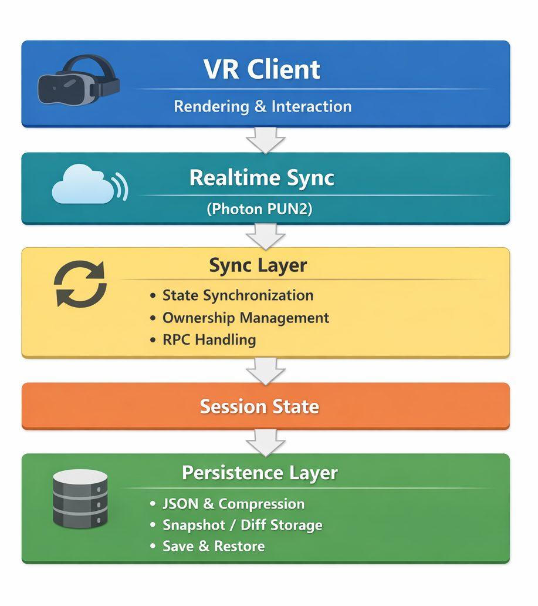

# マルチユーザーVR設計支援システム (室内外シームレスVR × リアルタイム協働)
> 室内と屋外を同時に、複数人でリアルタイム設計できるVRシミュレーション

---
## 概要

**マルチユーザーVR設計支援システム**として、

既存コードのない状態からゼロベースで設計・実装。

学部〜修士研究として、研究テーマ（室内外シームレスVR）のもと
- 研究設計・企画具体化
- マルチユーザー通信
- セッション管理・永続化
- 機能設計
- UX・操作設計
- 評価実験設計および実施
- 英語論文執筆・国際発表

を一貫して担当。

英語論文執筆については助教の支援を受けつつ遂行。

研究成果は査読付き国際会議  
15th International Conference on Digital Image Processing and Pattern Recognition（DPPR2025） 
に採択・発表。

※ Meta Quest 2 実機上で動作検証済み。

---

## 背景
従来の設計支援システムの問題点

- 室内／屋外が分断
- 単一ユーザーのみに対応

| システム例 | インテリア | エクステリア | マルチユーザー |
|------|------| ------|------|
| IKEA Place | ○ | × | × |
| メタバガーデン | × | ○ | × |
| VR設計一般 | ○/× | ×/○ | × |

→ 室内外の関係性を考慮した設計検討や、複数人でのリアルタイム協議が困難。

これらの課題を解決するために、

**室内外のシームレス統合 × リアルタイム協働設計**

を両立したシステムを提案。

特に、
- 内見支援
- デザイナー協働

への応用を想定。

---

## システム構成

（アーキテクチャ図、仮）

## 使用技術

- Unity 2022.3.11.f1
- C#
- Photon PUN2
- Meta Quest 2

---
## VR特有の設計配慮

### ①ロコモーション設計（VR酔い対策）

| 移動方式 | 想定ユーザー |
|------|------|
| テレポート移動 | VR初心者 |
| スムーズ移動 | VR経験者 |

- 加速度制御
- カメラ移動の滑らかさ調整
- 視覚・身体感覚の不一致軽減

  VR酔いの抑制を重視した設計。

### ②インタラクション設計

コントローラー操作を簡潔に設計。

| 操作 | 機能 |
|------|------|
| シングルトリガー | オブジェクト編集 |
| ダブルトリガー | 編集UI表示 |
| グラブ操作 | 3Dオブジェクト配置 |

- メニュー階層を最小化
- 直感的な3D操作を優先
- 空間内UIの過密回避

### ③空間UI設計

- 1画面1オブジェクト編集方式
- 視認性を考慮したUI距離設計
- 空間内のUI密度最適化

---

## 主な機能

### ■ マルチユーザー機能
- ルーム内最大5ユーザー同時接続
- オフラインモード対応
- 分散リアルタイム同期

### ■ 設計支援機能
- 室内外のシームレス統合
- ロコモーション操作（テレポート／スムーズ移動、空間ワープ）
- 3Dオブジェクト操作(生成・配置・回転・削除)
- 内外装表面の材質変更（天井・内外壁・床・階段・屋根・ドア等）
- 室内照明・日照・街灯のリアルタイム変更

### ■ セッション管理
- セッション保存／復元
- 途中参加時の最新状態同期

---

## デモ

### ロコモーション

https://github.com/user-attachments/assets/bcd214ba-2f8d-4da0-9c65-42a48653234f

### 3Dオブジェクト操作(生成・配置・回転・削除)

https://github.com/user-attachments/assets/e679222e-a34f-4b51-8879-8b817773412e

### 内外装表面の材質変更

https://github.com/user-attachments/assets/f461baba-e927-4fae-98bb-7acea6d882d3

### 室内照明シミュレーション

https://github.com/user-attachments/assets/93634dd9-aae4-4424-a8cf-9ef3f95ccfcd

### 時間変化シミュレーション(日照・街灯)

https://github.com/user-attachments/assets/0ac1c4ba-144e-4e3a-a380-5127c1f445fe

※家の内部構造なども全て自分で作成しています

---

## 研究実績
- 査読付き国際会議発表 15th International Conference on Digital Image Processing and Pattern Recognition (DPPR2025)
- 修士論文（2026年）
- 英語論文執筆・英語発表

---

